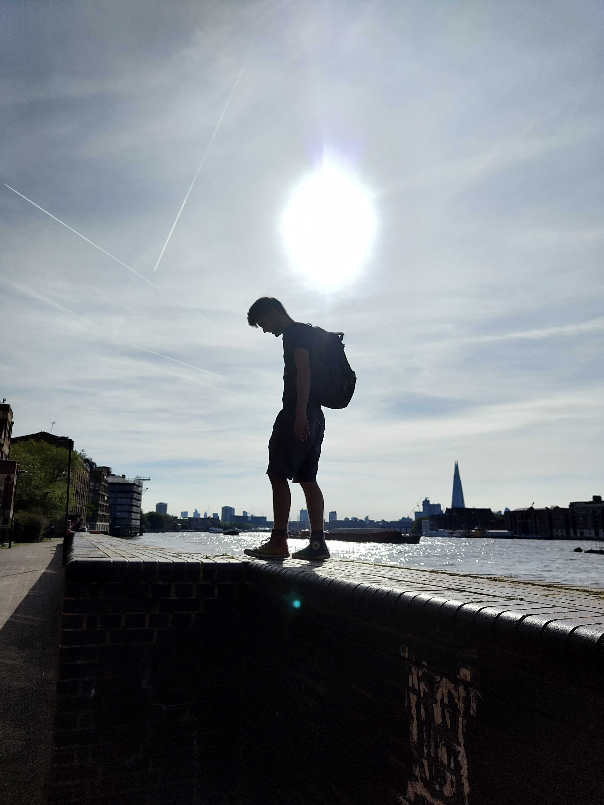

# Christopher Dobson — Art Model, Amsterdam

I moved to Amsterdam in March 2025. In September of that year, I began working as a model for art classes. What started as a paid hobby has turned into my full-time job.

I model for life drawing sessions, painting classes, and sculptors — both clothed and nude. You can read more about my work at my main website: [artmodel.chris](https://chrisdobson.github.io/web/page).

---

## Artwork featuring me

One of the most rewarding aspects of this work is seeing what artists create. Below are some examples.

### Bastiaan Mol

[Bastiaan Mol](https://www.bastiaanmol-maleart.nl/) is a Rotterdam-based painter who specialises in the sensual male figure. I have modelled for Bastiaan on several occasions and I am always moved by the results. You can explore his full portfolio at [bastiaanmol-maleart.nl](https://www.bastiaanmol-maleart.nl/).

---

## Where I have modelled

I have modelled for a range of studios, academies, and ateliers across the Netherlands, including in Amsterdam, Haarlem, Gouda, Amstelveen, Assen, and Rotterdam. A full list is on [my website](https://chrisdobson.github.io/web/page).

---

## Support my work

If you enjoy following my modelling journey and would like to support me financially, I would be very grateful. You can make a contribution via PayPal:

**[💛 Support me on PayPal](https://paypal.me/cspdobson)**

---

## Get in touch

- 🌐 Website: [chrisdobson.github.io/web/page](https://chrisdobson.github.io/web/page)
- 🦋 Bluesky: [@cspdobson](https://bsky.app/profile/cspdobson.bsky.social)
- 📸 Instagram: [@artmodel_chris](https://instagram.com/artmodel_chris)
- 🎨 Patreon: [patreon.com/modelchris](https://patreon.com/modelchris)